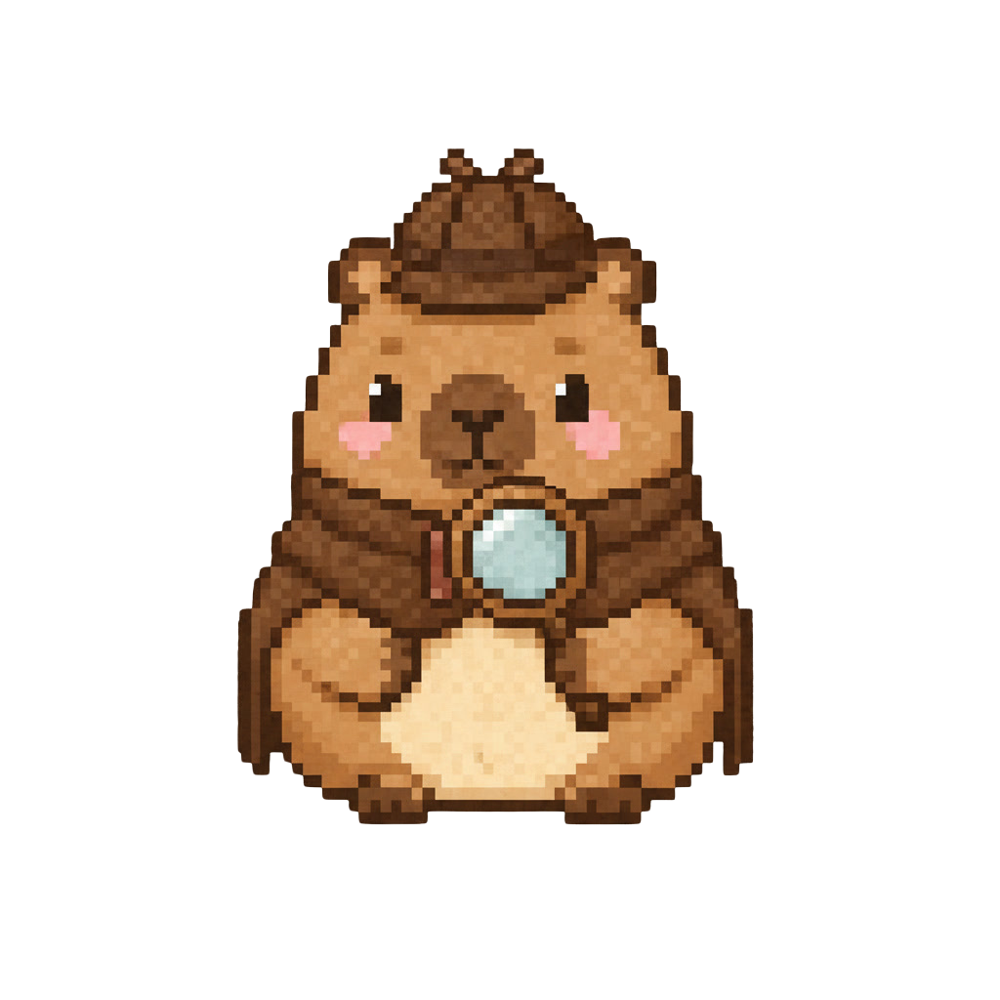

<h1>
  
  CapyCode
</h1>

<p>
  
  
  
  
  
  
  
  
  
</p>

*​A desktop AI coding companion built around the idea that understanding should come before answers.*


## The Idea

I built CapyCode after noticing something about the AI tools I used every day.

Most coding assistants are incredibly good at producing answers, but they often encourage you to move on before you've had the chance to understand *why* something works.

That made me wonder:

> What if an AI coding assistant behaved more like a patient companion than a code generator?

That question became CapyCode.

Rather than focusing only on generating code, CapyCode lives on the desktop as a lightweight companion that adapts to conversations, helps investigate bugs, celebrates progress, remembers previous chats, and lets users connect their own AI provider.

---

## What CapyCode Grew Into

What started as a simple idea gradually became an opportunity to explore desktop application development, conversational AI, state management, persistence, and designing software with a little more personality.

Along the way, I experimented with ideas like mood-driven interactions, local conversation history, provider abstraction for different LLMs, and creating an experience that feels less like another chat window and more like a companion that quietly stays alongside your workflow.

While CapyCode is still evolving, building it has been just as much about learning how these systems come together as it has been about the final application itself.

---

## Living on the Desktop

From the beginning, I wanted CapyCode to feel like something that stayed with me while I worked rather than another tool I constantly switched to. That idea shaped almost every design decision, from how conversations are remembered to how the companion responds throughout a coding session.

### It remembers

Coding sessions rarely begin and end with a single question. CapyCode stores conversations locally so they can be revisited later, while intelligently managing the amount of context sent to the AI to keep responses efficient.

- Persistent conversations stored locally using SQLite
- Context-aware conversation history to reduce unnecessary token usage
- Streaming AI responses
- Bring your own API keys
- Support for Groq and Google Gemini

### It reacts

Rather than remaining static, CapyCode responds to the flow of a conversation through a lightweight mood system. The goal isn't to interrupt your workflow, but to make interactions feel a little more expressive.

<p>
<b>Detective</b>
 
— Investigates bugs and helps navigate debugging sessions.
</p>

<p>
<b>Builder</b>
 
— Joins project planning and feature discussions.
</p>

<p>
<b>Concerned</b>
 
— Offers encouragement during frustrating moments.
</p>

<p>
<b>Thinking</b>
 
— Appears while generating responses.
</p>

<p>
<b>Celebration</b>
 
— Celebrates meaningful achievements and major milestones.
</p>

<p>
<b>Cheerleader</b>
 
— Encourages progress and keeps momentum going.
</p>

<p>
<b>Sleepy</b>
 
— Rests after periods of inactivity before welcoming you back.
</p>
### It stays with you

Small interactions were just as important to me as the conversations themselves. Instead of disappearing into the background, CapyCode stays nearby, remembers where you left it, and is designed to feel like a consistent companion throughout a coding session.

Today, that includes:

- Transparent, always-on-top window
- Draggable companion
- Local-first conversation storage
- Cross-platform support for Windows and macOS
---

## Under the Hood

Although CapyCode appears simple on the surface, it brings together several ideas I wanted to explore while building it. Rather than centering everything around a single chat component, the application is split into independent pieces responsible for conversations, AI providers, persistence, and companion behaviour.

At a high level, CapyCode looks like this:

```text
                   React + TypeScript
                           │
                    Chat Interface
                           │
                    Zustand Store
                           │
        ┌──────────────────┼──────────────────┐
        │                  │                  │
 Mood System      Conversation Layer    AI Provider Layer
        │                  │                  │
        │               SQLite         Groq / Gemini
        │
     Desktop Companion
```

Each layer has a single responsibility.

- **The UI** focuses entirely on the user experience.
- **The state layer** manages conversations and companion behaviour.
- **The AI layer** abstracts different providers behind a common interface.
- **The persistence layer** stores conversations locally so they survive between sessions.

Keeping these responsibilities separate made it much easier to add new providers, improve the companion's behaviour, and expand the project without constantly rewriting existing code.


---

## Project Structure

As CapyCode grew, I wanted each part of the application to have a clear responsibility instead of collecting everything into a handful of large files. The project is organised around independent modules that handle the interface, companion behaviour, AI integration, persistence, and desktop functionality.

```text
CapyCode
├── src/
│   ├── components/        # Chat interface, companion, settings and UI
│   ├── store/             # Global state and mood management
│   ├── lib/
│   │   ├── ai/            # AI providers, context management and streaming
│   │   ├── bridge.ts      # Desktop bridge utilities
│   │   └── moodMachine.ts # Companion behaviour and state transitions
│   ├── db/                # SQLite schema, migrations and repositories
│   ├── assets/            # Companion artwork and static assets
│   └── styles/            # Global styling
│
├── src-tauri/
│   ├── src/               # Rust backend
│   ├── capabilities/      # Tauri permissions and capabilities
│   ├── icons/             # Application icons
│   └── tauri.conf.json    # Desktop configuration
│
├── docs/                  # Documentation
└── .github/               # CI workflows
```

The project is intentionally organised into loosely coupled modules so that the interface, AI providers, persistence layer, and companion behaviour can evolve independently as CapyCode grows.

---


## Engineering Trade-offs

Every project involves balancing simplicity, performance, and flexibility. CapyCode intentionally makes a few engineering trade-offs to keep the application lightweight today while leaving room for future improvements.

### Conversation Memory

To reduce token usage and API costs, CapyCode doesn't send the entire chat history with every request. Instead, it builds a context window using only the most relevant recent messages.

This keeps responses fast and efficient, but extremely long conversations may gradually lose older context until a long-term memory system is introduced.

### AI Providers

CapyCode doesn't include built-in AI access. Instead, users connect their own API keys and choose the provider they'd like to use.

Because of this, response quality, available models, quotas, and rate limits depend entirely on the selected provider rather than CapyCode itself.

### Companion Intelligence

The companion follows a predefined event-driven mood system. It can react to events such as debugging, project discussions, achievements, frustration, and inactivity, but it doesn't yet learn from previous sessions or adapt its personality over time.

### Platform Support

CapyCode is built with a cross-platform architecture using Tauri.

The application currently targets Windows, while the same codebase is designed to support macOS as development continues.

---

## Where It's Going

CapyCode started as a way to explore a different kind of AI coding experience, but I don't see this as a finished project. There are still plenty of ideas I'd like to experiment with as I continue building it.

### Today

- [x] Native desktop application
- [x] Persistent conversations
- [x] Context-aware conversation management
- [x] Streaming AI responses
- [x] Mood-driven companion behaviour
- [x] Detective and Builder modes
- [x] Bring your own API keys
- [x] Groq integration
- [x] Google Gemini integration
- [x] Transparent, draggable companion window
- [x] Local-first conversation storage
- [x] Cross-platform support for Windows and macOS

### Exploring Next

- [ ] VS Code extension
- [ ] Additional AI providers
- [ ] Model selection for each provider
- [ ] Long-term memory
- [ ] Conversation search
- [ ] Custom companion themes and outfits
- [ ] Plugin support for custom behaviours
- [ ] Smarter contextual understanding across conversations

---

## Getting Started

### Prerequisites

Before running CapyCode locally, make sure you have:

- Node.js 20+
- Rust
- Tauri v2 prerequisites
- Git

### Clone the repository

```bash
git clone https://github.com/<your-username>/CapyCode.git
cd CapyCode
```

### Install dependencies

```bash
npm install
```

### Start the application

```bash
npm run tauri:dev
```

### Build for production

```bash
npm run tauri:build
```

### AI Providers

CapyCode doesn't ship with API keys.

To start chatting:

1. Open **Settings**.
2. Choose your preferred AI provider.
3. Enter your own API key.
4. Start chatting.

Currently supported:

- Groq
- Google Gemini

---

## About the Author

Designed and built by Siya Malik as an exploration of desktop applications, conversational AI, and creating more human-like interactions with technology.

You can find more of my work here:

- LinkedIn: https://www.linkedin.com/in/siya-m-704141219/
- GitHub: https://github.com/siyamlk

CapyCode is open source and still evolving. If you enjoy the project, consider giving it a ⭐. If you find a bug, have an idea for an improvement, or simply want to connect, I'd love to hear from you.

---

## License

This project is licensed under the **MIT License**. See the `LICENSE` file for more information.

---


<p align="center">
  <em>Thanks for stopping by ♡</em>
</p>

<p align="center">
  <em>
    Hope CapyCode made your coding sessions a little cozier.
  </em>
  
</p>